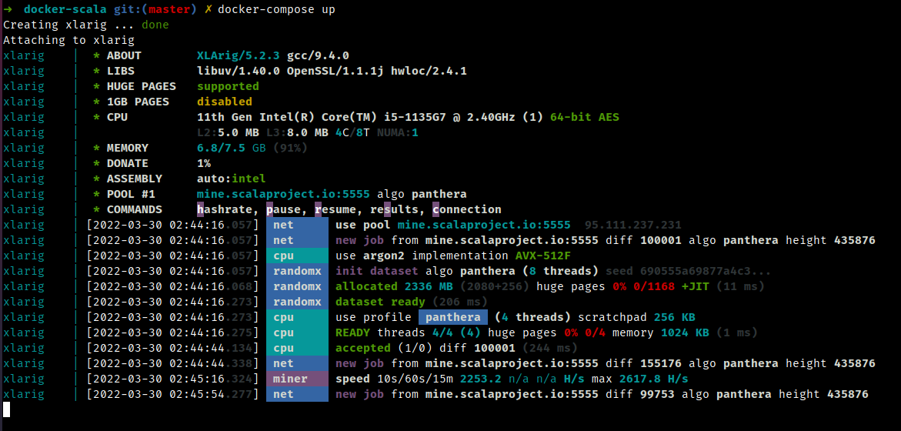

## docker-xlarig
Simple Dockerfile for Scala (XLArig) based on Ubuntu 20.04
1. XLArig source: https://github.com/scala-network/XLArig

## How to run
1. Clone this repo
2. Open data/config.json, update to  your prefered:
- Mining pool, I use scalaproject.io as default pool
- Diff, I use 5555 (or equal to mid-end HW, if you're using arm64 based I suggest to use 3333)
- Wallet, make sure to use your XLA address. not mine :)
3. Build & run it from your VPS (or run in cluster mode FTW?)
```
docker build -t ceroberoz/docker-xlarig:latest .
docker-compose up
```

## License
_Guess it was MIT?_
MIT
